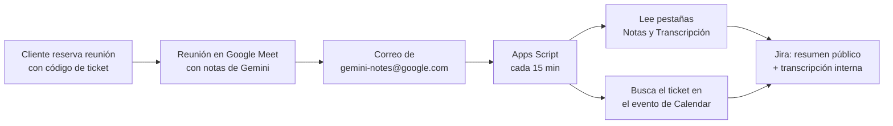

# Gemini Meet Notes → Jira

Automatización en **Google Apps Script** que publica en Jira Service Management las notas y la transcripción que Gemini genera al terminar una reunión de Google Meet.

- **Resumen de la reunión** → comentario **público** en el ticket (lo ve el cliente).
- **Transcripción completa** → **nota interna** en el ticket (solo agentes).
- Limpia automáticamente los pies de página que agrega Gemini (encuesta, avisos de precisión).
- No duplica comentarios: cada documento y cada comentario se publican una sola vez, incluso si hay reintentos.

Sin servidores ni costos: corre dentro de tu propia cuenta de Google, cada 15 minutos.

<!-- TODO imagen: docs/img/resultado-jira.png
     Captura de un ticket de Jira con el comentario público del resumen y la nota interna
     de la transcripción. Usar un ticket de prueba o difuminar nombres del cliente.
     Al subirla, descomentar la línea siguiente. -->
<!--  -->

---

## 🔄 Cómo funciona



El código de ticket (ej. `SOP2-1234`) se obtiene del **evento de Google Calendar** de la reunión. Hay dos formas de que quede ahí:

| Opción | Cuándo usarla |
|---|---|
| **A. Formulario de reserva** (recomendada) | El cliente reserva desde tu página de citas y escribe el código en un campo obligatorio. |
| **B. Descripción del evento** | Reuniones creadas a mano, fuera de la página de citas. Escribes el código en la descripción del evento. |

Ambas están explicadas con capturas en la [guía](docs/guia.md#4-configurar-google-calendar).

---

## 📂 Estructura del repositorio

```
gemini-meet-notes-to-jira/
│
├── src/
│   ├── Code.gs             # Script principal de Apps Script
│   └── appsscript.json     # Manifiesto (zona horaria y runtime)
│
├── docs/
│   ├── guia.md             # Guía detallada de instalación y configuración
│   └── img/                # Imágenes de la guía
│
├── .gitignore
├── LICENSE                 # MIT License
└── README.md               # Este archivo
```

---

## ✅ Requisitos

- Cuenta de Google Workspace con **Gemini en Meet** (toma de notas y transcripción).
- Ser **agente** en el proyecto de Jira Service Management donde se publicarán los comentarios.
- Un **token de API de Atlassian** personal.
- Ser el **organizador** de las reuniones: Gemini envía el correo de notas al organizador, y el script lee el buzón de quien lo instala.

---

## ⚡ Instalación rápida

1. Crea un proyecto nuevo en [Google Apps Script](https://script.google.com/).
2. Copia el contenido de [`src/Code.gs`](src/Code.gs) en tu proyecto.
3. Ve a **Configuración del proyecto → Propiedades del script** y añade:

| Propiedad | Ejemplo | Descripción |
|---|---|---|
| `JIRA_BASE` | `https://tu-org.atlassian.net` | URL base de tu instancia de Jira |
| `JIRA_USER_EMAIL` | `tu.correo@empresa.com` | Correo con el que entras a Atlassian |
| `JIRA_API_TOKEN` | `••••••••••••` | Token de API de Atlassian |

4. Ejecuta, en este orden:
   - `testJiraConnection()` → debe responder `200`.
   - `testDocument()` → con el ID de un Doc de Gemini tuyo; revisa el log.
   - `setup()` → crea las etiquetas de Gmail y el trigger cada 15 minutos.

---

## 🏷️ Etiquetas de Gmail

El script marca cada correo de Gemini con una etiqueta según el resultado:

| Etiqueta | Significado |
|---|---|
| `gemini-notes/procesado` | Publicado en Jira correctamente |
| `gemini-notes/sin-ticket` | No se encontró el código de ticket. Requiere acción manual |
| `gemini-notes/error` | Falló algo (red, permisos, Jira). Se reintenta en el siguiente ciclo |

---

## 📘 Guía completa

Paso a paso con capturas, obtención del token, configuración del calendario y solución de problemas: [`docs/guia.md`](docs/guia.md).

---

## 📄 Licencia

Este proyecto está bajo licencia [MIT](LICENSE).
Puedes usarlo, modificarlo y compartirlo libremente, dando crédito al autor.

---

## ✨ Autor

Creado por **Aaron Cance**
📧 Contacto: [aaron.cance@gmail.com](mailto:aaron.cance@gmail.com)
