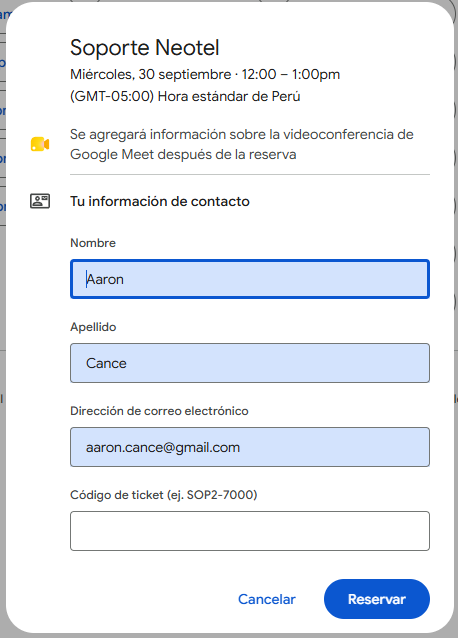
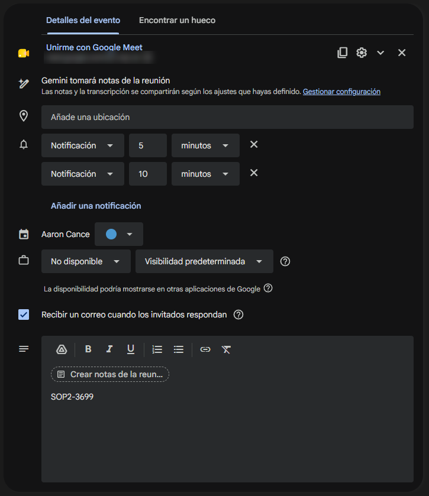

# 📘 Guía de instalación y configuración

Esta guía te lleva desde cero hasta tener las notas y transcripciones de Gemini publicándose solas en tus tickets de Jira. Tiempo estimado: **20 minutos**.

## Índice

1. [Antes de empezar](#1-antes-de-empezar)
2. [Obtener el token de API de Atlassian](#2-obtener-el-token-de-api-de-atlassian)
3. [Activar notas y transcripción de Gemini](#3-activar-notas-y-transcripción-de-gemini)
4. [Configurar Google Calendar](#4-configurar-google-calendar)
5. [Crear el proyecto de Apps Script](#5-crear-el-proyecto-de-apps-script)
6. [Configurar las propiedades del script](#6-configurar-las-propiedades-del-script)
7. [Probar antes de activar](#7-probar-antes-de-activar)
8. [Activar la automatización](#8-activar-la-automatización)
9. [Operación diaria](#9-operación-diaria)
10. [Solución de problemas](#10-solución-de-problemas)
11. [Seguridad](#11-seguridad)

---

## 1. Antes de empezar

Cada persona instala **su propia copia** del script en **su propia cuenta**. No se comparte un único script entre el equipo, porque:

- Gemini envía el correo de notas **al organizador** de la reunión, y el script lee tu buzón.
- Los comentarios en Jira se publican **con tu usuario**, usando tu token personal.

Necesitas:

- [ ] Cuenta de Google Workspace con Gemini en Meet.
- [ ] Rol de **agente** en el proyecto de Jira Service Management (sin él no se pueden crear notas internas).
- [ ] Acceso a [script.google.com](https://script.google.com/).

---

## 2. Obtener el token de API de Atlassian

1. Entra a [id.atlassian.com/manage-profile/security/api-tokens](https://id.atlassian.com/manage-profile/security/api-tokens).
2. Haz clic en **Crear token de API**.
3. Ponle un nombre que reconozcas, por ejemplo `apps-script-gemini-notes`.
4. Elige la fecha de expiración. Atlassian exige una; **anótala en tu calendario** para renovarlo antes de que venza, porque el día que expire el script dejará de publicar.
5. Copia el token. **Solo se muestra una vez.** Si lo pierdes, crea otro.

<!-- TODO imagen: docs/img/atlassian-api-token.png
     Captura de la pantalla de creación del token de API en id.atlassian.com.
     Si ya tienes "atlassianperfil.png" del repo jira-auto-assign-comment-transition-trigger,
     puedes reutilizarla con este nombre. Asegúrate de que NO se vea ningún token.
     Al subirla, descomentar la línea siguiente. -->
<!--  -->

---

## 3. Activar notas y transcripción de Gemini

El script necesita que el documento de Gemini tenga **dos pestañas**: las notas y la transcripción. Si solo activas las notas, se publicará el resumen pero no la transcripción.

1. En Google Calendar, abre un evento con Google Meet.
2. En la sección de Gemini verás *"Gemini tomará notas de la reunión"*. Haz clic en **Gestionar configuración**.
3. Verifica que estén activadas **las notas** y **la transcripción**.

<!-- TODO imagen: docs/img/gemini-configuracion.png
     Captura de la ventana "Gestionar configuración" de Gemini con notas y transcripción activadas.
     Al subirla, descomentar la línea siguiente. -->
<!--  -->

> 💡 Haz una reunión de prueba de un par de minutos y abre el documento que llega por correo. Debe tener una pestaña de notas y otra cuyo título contenga **"Transcripción"**.

---

## 4. Configurar Google Calendar

El script busca el código de ticket en el **evento de Calendar** de la reunión. Tienes dos formas de dejarlo ahí.

### Opción A — Formulario de reserva (recomendada)

Si tus clientes agendan desde tu **página de programación de citas**, agrega una pregunta obligatoria para el código de ticket. Así el código queda guardado en el evento sin que tengas que hacer nada.

1. En Google Calendar: **Crear → Programación de citas** (o edita la que ya tienes).
2. Baja hasta **Formulario de reserva**.
3. Haz clic en **Añadir elemento** y crea una pregunta con el texto:
   **`Código de ticket (ej. SOP2-7000)`**
4. Márcala como **obligatoria**.
5. Guarda.

📺 Video recomendado para configurar la página de citas desde cero: [Cómo configurar la programación de citas en Google Calendar](https://www.youtube.com/watch?v=9PdGYMFvb50)

<!-- TODO imagen: docs/img/configurar-formulario-reserva.png
     Captura del editor de la programación de citas, sección "Formulario de reserva",
     mostrando la pregunta "Código de ticket (ej. SOP2-7000)" marcada como obligatoria.
     Al subirla, descomentar la línea siguiente. -->
<!--  -->

Así lo ve el cliente al reservar:



> ℹ️ El script ignora automáticamente el texto de ejemplo `(ej. SOP2-7000)` de la pregunta, así que no hay riesgo de que publique en ese ticket.

### Opción B — Código en la descripción del evento

Para reuniones que **no** pasan por la página de citas (las creas tú a mano, te las reenvían, reuniones internas sobre un ticket), escribe el código de ticket en la **descripción del evento**:



Recomendaciones:

- Pon **solo un** código de ticket en la descripción. Si hay varios, el script toma el primero.
- Hazlo **antes** de que termine la reunión, o al menos antes de que pasen 7 días. Si llega el correo de Gemini y el evento aún no tiene código, el correo queda con la etiqueta `gemini-notes/sin-ticket` (ver [Operación diaria](#9-operación-diaria)).

### ¿Y si no hay código en el evento?

Como respaldo, el script también busca un código de ticket dentro de las notas y la transcripción. Si durante la reunión alguien menciona *"SOP2-1234"* en voz alta, es probable que lo encuentre. Pero no lo trates como método principal: es un plan B.

---

## 5. Crear el proyecto de Apps Script

1. Entra a [script.google.com](https://script.google.com/) → **Nuevo proyecto**.
2. Renómbralo, por ejemplo: `Gemini Notes → Jira`.
3. Borra el contenido de `Código.gs` y pega todo el contenido de [`src/Code.gs`](../src/Code.gs).
4. Guarda (`Ctrl + S`).

**Opcional pero recomendado — zona horaria:**

1. Ve a **Configuración del proyecto** (ícono ⚙️).
2. Activa **Mostrar el archivo de manifiesto "appsscript.json" en el editor**.
3. Vuelve al editor, abre `appsscript.json` y reemplaza su contenido por el de [`src/appsscript.json`](../src/appsscript.json).

Esto fija la zona horaria en `America/Lima`, que se usa para la fecha que aparece en el encabezado de la transcripción. Si trabajas en otra zona, cámbiala.

---

## 6. Configurar las propiedades del script

Ve a **Configuración del proyecto → Propiedades del script → Añadir propiedad del script**.

| Propiedad | Valor |
|---|---|
| `JIRA_BASE` | URL de tu Jira. Ej: `https://tu-org.atlassian.net` |
| `JIRA_USER_EMAIL` | El correo con el que entras a Atlassian |
| `JIRA_API_TOKEN` | El token del [paso 2](#2-obtener-el-token-de-api-de-atlassian) |

> ℹ️ Con el uso verás aparecer más propiedades con nombres como `done:1AbCdEfGh…` y valores como `SOP2-1234@2026-09-04T16:42:28Z`. Las crea el script: son el registro de qué reuniones y comentarios ya se publicaron, y es lo que evita duplicados (ver [Cómo evita duplicados](#cómo-evita-duplicados)). **No las borres**, salvo que quieras reprocesar una reunión.

<!-- TODO imagen: docs/img/propiedades-script.png
     Captura de la pantalla de Propiedades del script con las variables cargadas.
     IMPORTANTE: tapar/difuminar el valor de JIRA_API_TOKEN (y el correo si prefieres).
     Al subirla, descomentar la línea siguiente. -->
<!--  -->

---

## 7. Probar antes de activar

Ninguna de estas dos pruebas publica nada en Jira. Ejecútalas desde el editor: selecciona la función en el desplegable superior y pulsa **Ejecutar**.

### 7.1 `testJiraConnection()`

La primera vez Google pedirá permisos (Gmail, Documentos, Calendar, conexiones externas y activadores). Acéptalos: el script solo actúa sobre tu cuenta.

En el registro de ejecución debe aparecer `200 -> {...}` con tus datos de Atlassian. Si aparece `401`, revisa el correo o el token.

### 7.2 `testDocument()`

1. Abre un documento de notas de Gemini de una reunión real que tenga el código de ticket en su evento.
2. Copia el ID de la URL: `https://docs.google.com/document/d/`**`ESTE_ES_EL_ID`**`/edit`
3. Pégalo en la línea `var docId = 'PEGA_AQUI_EL_ID_DE_TU_DOC_DE_GEMINI';` de la función `testDocument`.
4. Ejecuta `testDocument()`.

Revisa en el log:

- **Ticket detectado** → debe ser el correcto.
- **NOTAS** → el resumen, **sin** el párrafo de *"Revisa las notas de Gemini…"* ni la encuesta.
- **TRANSCRIPCIÓN** → el inicio de la transcripción, **sin** el aviso de *"Esta transcripción editable se generó por computadora…"*.

---

## 8. Activar la automatización

> ⚠️ **Antes de activar:** en su primera corrida, el script publicará en Jira **todas** las reuniones de Gemini de los **últimos 7 días**. Si ya subiste alguna a mano, evita duplicarla: en Gmail crea la etiqueta `gemini-notes/procesado` (como subetiqueta de `gemini-notes`) y aplícala a esos correos de Gemini. El script los ignorará.

Ejecuta `setup()`.

Deberías ver: `Listo: etiquetas creadas y trigger activo cada 15 minutos.`

A partir de aquí el script corre solo, aunque cierres el navegador. Puedes comprobarlo en el ícono ⏰ **Activadores** del editor.

<!-- TODO imagen: docs/img/activadores.png
     Captura del panel "Activadores" mostrando processGeminiNotes con evento "Basado en tiempo", cada 15 minutos.
     Al subirla, descomentar la línea siguiente. -->
<!--  -->

> ℹ️ Ejecutar `setup()` varias veces no duplica el trigger: primero borra el anterior.

---

## 9. Operación diaria

### Qué se publica en Jira

| Pestaña del Doc | Tipo de comentario | Formato |
|---|---|---|
| Notas | **Público** (Responder al cliente) | `Comparto el resumen de nuestra última reunión:` + resumen con títulos y viñetas |
| Transcripción | **Interno** (Nota interna) | `Transcripción completa de la reunión del dd/MM/yyyy HH:mm:` + texto completo |

Si la transcripción supera ~30.000 caracteres (límite de Jira), se divide en varias notas internas: *(parte 1 de 3)*, *(parte 2 de 3)*…

### Etiquetas de Gmail

| Etiqueta | Qué pasó | Qué hacer |
|---|---|---|
| `gemini-notes/procesado` | Publicado correctamente | Nada |
| `gemini-notes/sin-ticket` | No se encontró el código de ticket | Agrega el código a la descripción del evento y **quita la etiqueta** del correo. Se procesa en el siguiente ciclo. |
| `gemini-notes/error` | Falló algo (red, permisos, ticket inexistente) | Se reintenta solo. Si persiste, revisa **Ejecuciones** en el editor. |

<!-- TODO imagen: docs/img/etiquetas-gmail.png
     Captura de la barra lateral de Gmail con las etiquetas gemini-notes/procesado, sin-ticket y error.
     Al subirla, descomentar la línea siguiente. -->
<!--  -->

### Cómo evita duplicados

- La búsqueda de Gmail **excluye** los correos ya etiquetados como `procesado` o `sin-ticket`.
- Cada documento de Gemini se registra al terminar. Si el mismo Doc llega por otro correo (reenvío), no se vuelve a publicar.
- **Cada comentario** (resumen y cada parte de la transcripción) se registra por separado. Si algo falla a la mitad, el reintento solo sube lo que faltó; el cliente nunca recibe el resumen dos veces.
- Un bloqueo impide que dos ejecuciones trabajen al mismo tiempo.

### Reprocesar una reunión

Si necesitas volver a publicar una reunión (por ejemplo, borraste los comentarios por error):

1. Añade temporalmente esta función al final del script, con el ID del documento:

   ```javascript
   function reprocesar() {
     resetDocument('ID_DEL_DOC_DE_GEMINI');
   }
   ```

2. Ejecuta `reprocesar()`.
3. En Gmail, quita la etiqueta `gemini-notes/procesado` del correo de esa reunión.
4. Espera al siguiente ciclo (o ejecuta `processGeminiNotes()` a mano).
5. Borra la función `reprocesar()`.

---

## 10. Solución de problemas

| Síntoma | Causa probable | Solución |
|---|---|---|
| `testJiraConnection` devuelve `401` | Correo o token incorrecto, o token vencido | Revisa `JIRA_USER_EMAIL` y genera un token nuevo. |
| Error `404` al comentar | El ticket no existe o no tienes acceso a él | Verifica el código en el evento. |
| Error `400` o `403` al comentar | No eres agente del proyecto de Service Desk | Pide a un administrador de Jira que te agregue como agente. |
| Todo cae en `sin-ticket` | El evento no tiene el código, o el título del evento no coincide con el de la reunión | Usa la [Opción B](#opción-b--código-en-la-descripción-del-evento). No cambies el título del evento después de la reunión. |
| Se detecta un ticket equivocado | La descripción del evento tiene varios códigos o un texto parecido | Deja un solo código de ticket en la descripción del evento. |
| Se publica el resumen pero no la transcripción | La transcripción no está activada en Gemini | Revisa el [paso 3](#3-activar-notas-y-transcripción-de-gemini). |
| No aparece ningún correo procesado | Los correos tienen más de 7 días, o el organizador fue otra persona | El script solo revisa los últimos 7 días y solo reuniones que **tú** organizaste. Las más antiguas súbelas a mano. |
| Error de permisos (`No tienes permiso para llamar a…`) | Autorización incompleta o revocada | Ejecuta cualquier función a mano y vuelve a aceptar los permisos. |
| `Otra ejecución sigue activa` en el log | Una corrida anterior aún no terminaba | Es normal. Se procesa en el siguiente ciclo. |

---

## 11. Seguridad

- 🔒 El token **solo** va en las Propiedades del script. Nunca en el código, en capturas de pantalla ni en commits.
- Cada persona usa **su propio token**. No compartas el tuyo: los comentarios quedarían publicados a tu nombre.
- Si crees que tu token se filtró, revócalo de inmediato en [id.atlassian.com](https://id.atlassian.com/manage-profile/security/api-tokens) y crea uno nuevo.
- Al compartir capturas para pedir ayuda, difumina: token, correos de clientes, links de Meet y contenido de las transcripciones.
- La transcripción se publica **siempre** como nota interna. Si necesitas cambiar ese comportamiento, revisa la función `publishToJira()` con cuidado: una transcripción pública la vería el cliente.
